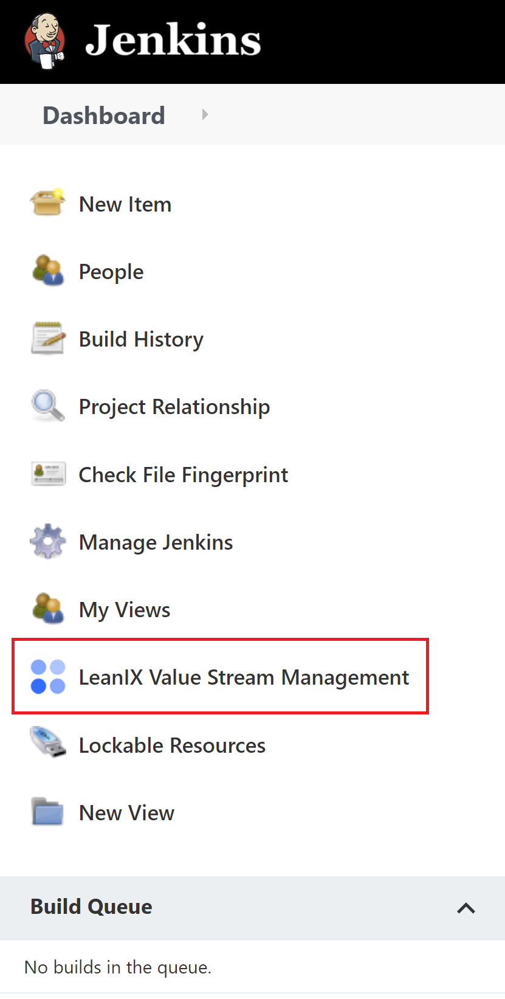
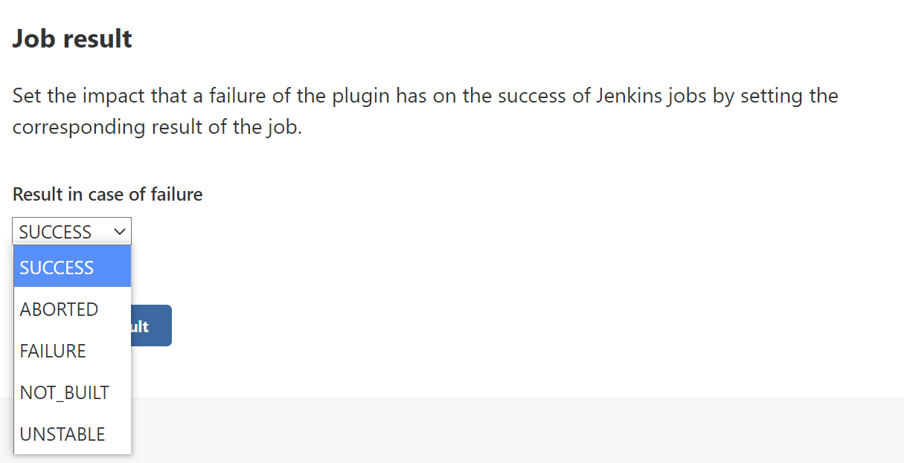

## Introduction

This plugin connects Jenkins Jobs with your LeanIX workspace. Information on your services built and deployed with Jenkins can be called up in LeaxIX factsheets when the plugin is integrated in your Jenkins pipelines and jobs.

## Prerequisites

In order to be able to use the LeanIX Microservice Intelligence Plugin, the following settings must first be made:

* The LeanIX Microservice Intelligence plugin must be installed: https://www.jenkins.io/doc/book/managing/plugins/
* You have a valid **LeanIX API token**.
* If you are **using scripted pipelines** in which the LeanIX plugin is to be integrated as a step, the "Credentials Binding" plugin must be installed: https://plugins.jenkins.io/credentials-binding/  
  For projects such as a **Freestyle project**, in which the plugin can be added via GUI as a build step, the plugin for injecting environment variables is required instead: https://plugins.jenkins.io/envinject/
* An **SCM provider** (e.g. Git) must be configured for the pipeline to be used and the possibly necessary plug-in installed.
* The **manifest file** made available by LeanIX and filled with the appropriate values is located in the corresponding repository, so that it can be accessed by the plugin. This is sent by the plugin to the LeanIX interface.

## Configuration

The configuration of the LeanIX Microservice Plugin is divided into three parts:

* [Setting up secrets in the Jenkins administration](#setting-up-secrets-in-the-manage-jenkins-area),
* [Central configuration of the plugin](#central-configuration-of-the-plugin),
* [Configuration of individual pipelines and jobs in which the plugin is to be used.](#configuration-of-individual-pipelines-and-jobs)

#### Setting up secrets in the Manage Jenkins area.
This section is only important if you want to use the LeanIX plugin in scripted pipelines. For this purpose, a new credentials record with the following parameters is created in the "Manage Jenkins" -> "Security" -> "Manage Credentials" area (a detailed description of how to create credentials can be found at the following link: https: // www .jenkins.io / doc / book / using / using-credentials /):
* Scope: It is best to select "global", unless security reasons or company guidelines speak against it.
* Username: The host and thus the part of a URL that specifies the region of the LeanIX service in which the workspace is located, to which the data extracted by the plugin is to be sent.
* Password: A valid API token for the LeanIX workspace that matches the host.
* ID: "LEANIX_CREDENTIALS" is suggested here, but any valid variable name can be selected. It just needs to be used accordingly in the pipeline.
* Desciption: No value is needed here.

#### Central configuration of the plugin

The plugin offers the possibility of central configuration of important settings. For these configurations, after installation, there is an area on the basic level "Dashboard" of Jenkins with the title "LeanIX Microservice Intelligence".

When you call this up, you will find several areas in which settings can be made.
In the uppermost area with the title "Pipeline Configuration in JSON format" there is an input field in which configurations in JSON format can be inserted.
The structure of these configurations is as follows:

In the second area, "Job result", you can make the basic setting for all jobs / pipelines, which impact a failure of the LeanIX build step will have for the entire job or the entire pipeline. One of the five options that Jenkins offers as a result can be selected here. If the plugin job fails, the selected result is set as the end result of the executed job.

#### Configuration of individual pipelines and jobs

## Usage